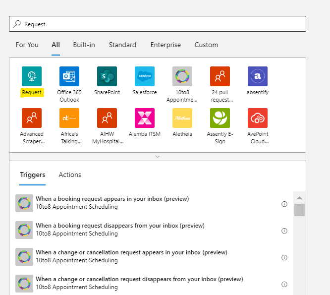
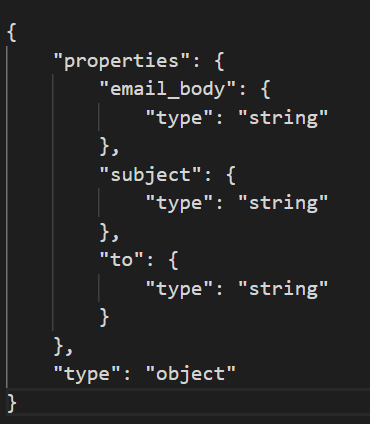
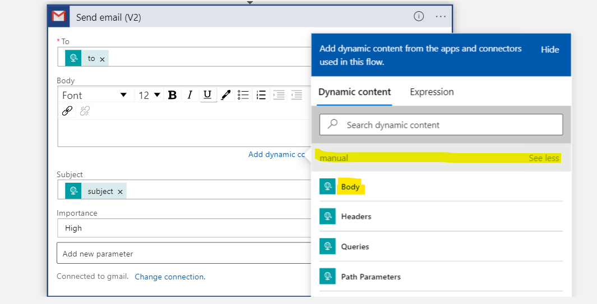
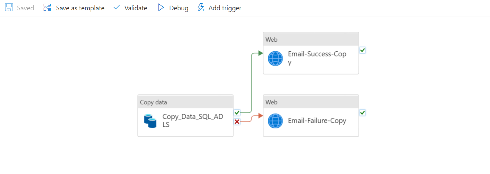

<h1 align = "center"> Send Email using Logic App with ADF<h1>

<h4>Required Services: </h4>
<ol>
  <li>Azure Subscription</li>
  <li>Azure Logic App</li>
  <li>Azure Data Factory</li>
  <li>Email Account</li>
</ol>

<h4> Below are the steps: </h4>

<ol>
    <h3><li> Create Azure Logic App service in Microsoft Azure </li></h3>
    <ul>
        <li> Select subscription, Resource Group and enter the logic app name</li>
        <li> If you're using this as an entry-level select <b>consumption</b> as your Plan Type, which will make sure you pay only when you use it. Rest you can leave as it is or modify if required, and you're good to create the logic app</li>
        
        <li> There are many pre-defined templates that are available, use a blank page to send an email</li>
        <li> Search with <b>Request </b> in search bar and select Request, which opens a new window that will ask you to select Trigger and an Action. 
            Every app that you select will contain   
                &nbsp;&nbsp;&nbsp;&nbsp;&nbsp;&nbsp;&nbsp;&nbsp;Trigger: which defines what is the triggering logic. 
                &nbsp;&nbsp;&nbsp;&nbsp;&nbsp;&nbsp;&nbsp;&nbsp;Action: which defines what action should it perform when the app is triggered.</li>
        
        <li> Select <b> When a HTTP Request is received</b>, HTTP URL will be generated once the logic app is saved. Now the important part of the complete proccess is to define the body of request. Define schema i.e. what are the parameters that you want to pass in the Email like Recipient Mail ID, Subject Line, Message body. For this the best way is to Use Sample payload to generate schema and add parameter --> Method and select the POST method.</li>
        
        <li> Now add new step and search with gmail and select <b> Send Email</b>, provide a connection name and use default shared application as authentication type and sign in into your account </li>
        <li> Now Add Parameters like to, Body, Subject, Importance and add value using dynamic content for all the fields and save it</li>
        `
        <li> Last step is to save the logic app and copy the HTTP POST URL generated by which we can trigger the logic app</li>
    </ul>
    <h3><li> Trigger Logic App in ADF Pipelines</li></h3>
    <ul>
        <li> Open the pipeline from which you want to send a mail, for suppose once the copy acitivty which copies data from Azure SQL to ADLS is done, you need to send a notification email of the status.</li> 
        
        <li> Create a web activity, provide the HTTP URL that is generated in Logic App and provide the BODY details 
        { 
        "to":"...@gmail.com", 
        "subject":"This is the Subject", 
        "email_body":"This is sample Body" 
        }</li>
    <ul>
</ol>

